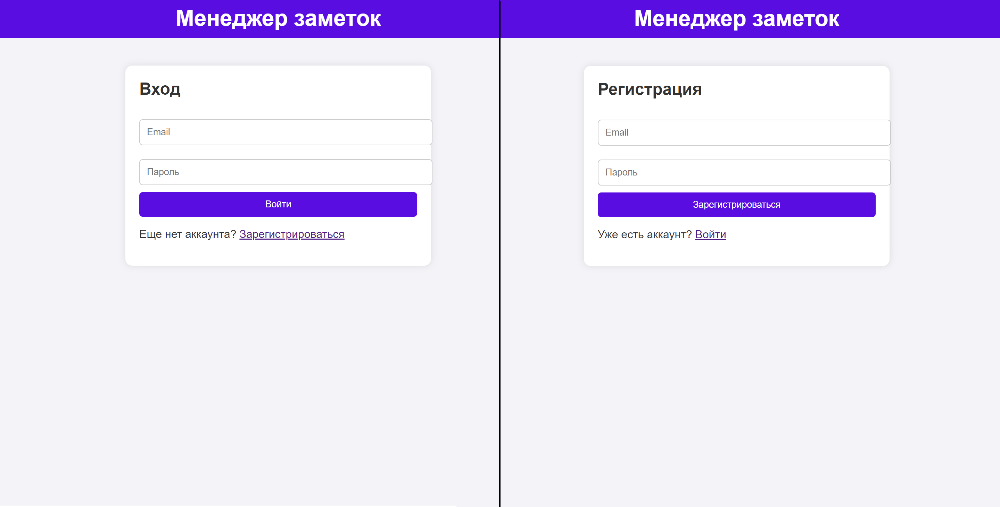
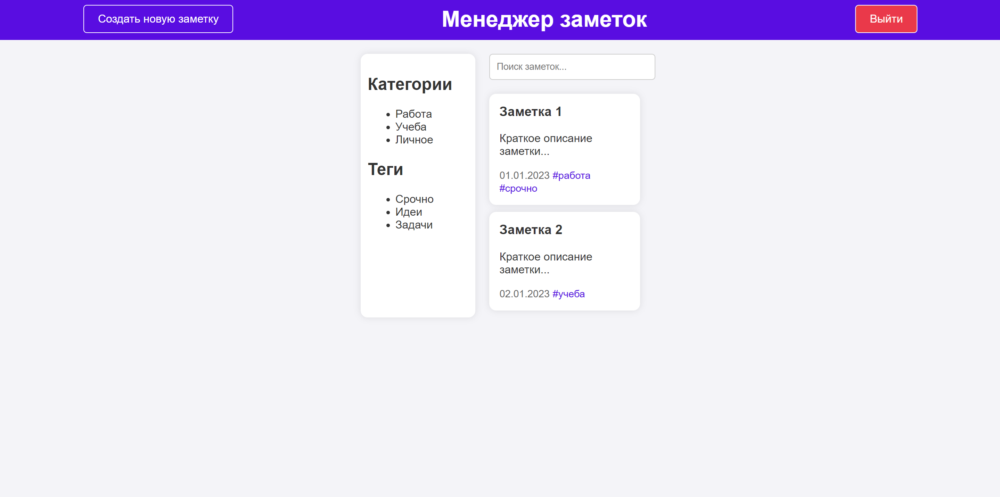
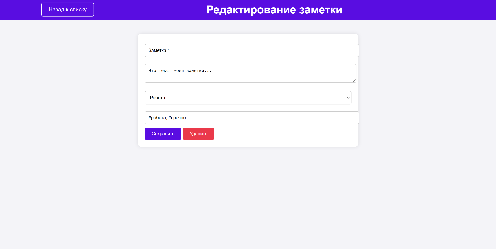
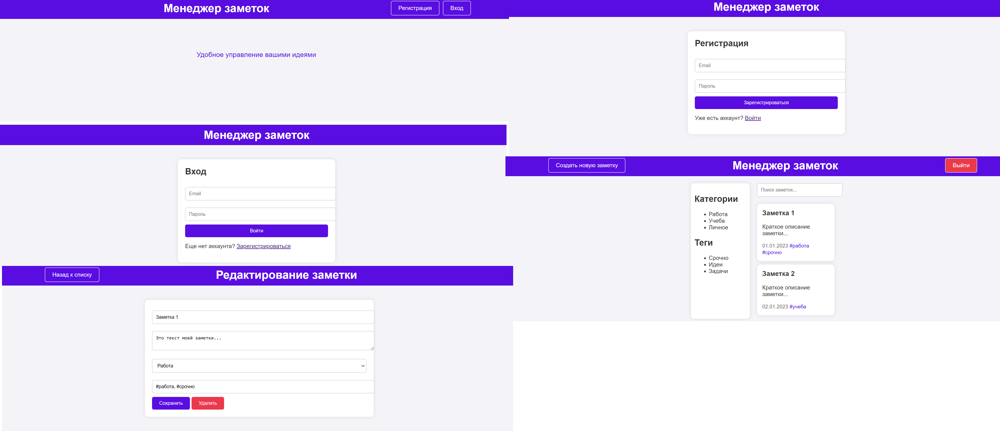

<h1 style="text-align:center;">
    Менеджер заметок    
</h1>

## Название проекта
Менеджер заметок

## Цель проекта
Создание удобного и интуитивно понятного веб-приложения для управления личными и рабочими заметками.

## Описание:
«Менеджер заметок» — это веб-приложение, предназначенное для создания, редактирования, хранения и организации заметок. Пользователи могут регистрироваться в системе, создавать новые заметки, редактировать существующие, а также структурировать их с помощью категорий, тегов и фильтров. Приложение ориентировано на пользователей, которые хотят упростить процесс ведения записей, будь то личные заметки, рабочие задачи или учебные материалы.

## Порядок работы с приложением

1. **Регистрация и вход:**
   - Пользователь регистрируется в системе или входит в существующий аккаунт.
   - После входа пользователь попадает на главный экран приложения.

2. **Главный экран:**
   - Отображается список всех заметок, отсортированных по дате создания или редактирования.
   - Пользователь может создать новую заметку, нажав на кнопку "Создать заметку".
   - Доступен поиск по заметкам и фильтрация по категориям или тегам.

3. **Создание и редактирование заметок:**
   - Пользователь открывает редактор заметок.
   - Возможность добавления тегов и выбора категории для заметки.
   - Сохранение заметки по нажатию кнопки "Сохранить".

4. **Организация заметок:**
   - Пользователь может создавать категории и назначать их заметкам.
   - Поиск по ключевым словам, тегам или категориям.

5. **Удаление:**
   - Пользователь может удалить заметку.

## Описание пользовательского интерфейса (UI)

### Главный экран
- В верхней части экрана расположена строка поиска и кнопка "Создать заметку".
- Список заметок отображается в центральной части экрана.
- Каждая заметка в списке отображается с заголовком, кратким описанием и датой последнего изменения.
- Справа от каждой заметки — иконки для редактирования, удаления и архивирования.

**Экран создания/редактирования заметки:**
- Поле для ввода заголовка заметки.
- Текстовое поле для основного содержимого с поддержкой базового форматирования.
- Выбор категории и добавление тегов.
- Кнопки "Сохранить" и "Удалить".

**Экран категорий и тегов:**
- Список всех категорий с возможностью добавления новых.
- Список всех тегов с возможностью их редактирования или удаления.

**Архив:**
- Список архивных заметок с возможностью восстановления или полного удаления.

## Функционал

**Основные функции:**
1. **Создание и редактирование заметок:**
   - Возможность добавления текста с базовым форматированием.
   - Добавление заголовка, тегов и категорий.

2. **Организация заметок:**
   - Создание и управление категориями.
   - Добавление и редактирование тегов.
   - Поиск по заметкам, тегам и категориям.

3. **Управление заметками:**
   - Удаление заметок.
   - Архивирование заметок с возможностью восстановления.

4. **Авторизация и безопасность:**
   - Регистрация и вход в систему.
   - Хранение данных пользователя в зашифрованном виде.

5. **Синхронизация:**
   - Синхронизация заметок между устройствами (если реализовано облачное хранение).

## Технические требования

**Фронтенд:**
- HTML, CSS.

**Бэкенд:**
- На этапе разработки

## Этапы разработки

1. **Проектирование:**
   - Создание прототипов интерфейса.
   - Разработка технической документации.

2. **Разработка фронтенда:**
   - Верстка интерфейса.
   - Реализация логики взаимодействия с пользователем.

3. **Разработка бэкенда:**
   - На этапе разработки

4. **Тестирование:**
   - Тестирование функционала.
   - Исправление ошибок.

5. **Запуск:**
   - Развертывание приложения на сервере.

## Макет Figma:

